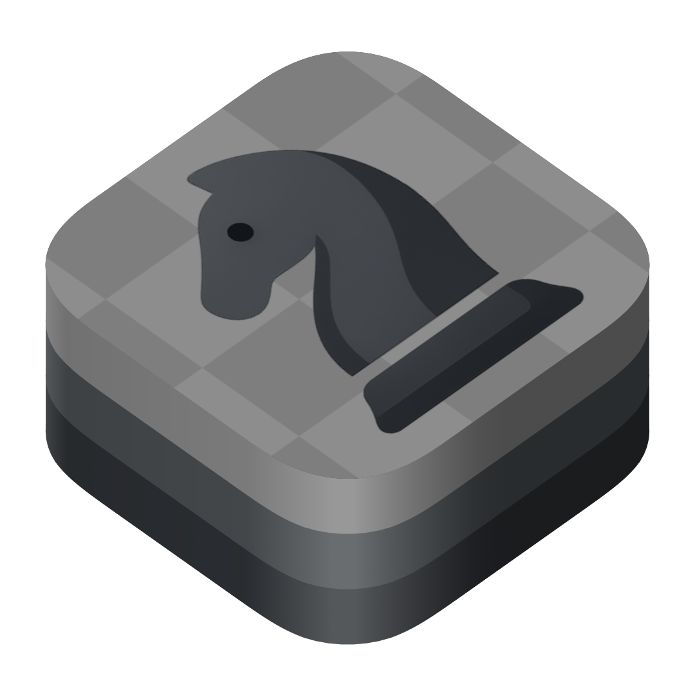

<div align="center">
    
</div>

# Fischer-core

[](https://codecov.io/gh/NSStudent/fischer-core)

`FischerCore` is a Swift library that encapsulates the core logic and data structures necessary for building chess games.
Named in honor of the legendary chess grandmaster **Bobby Fischer**, this library provides a comprehensive foundation for creating, managing, and enforcing the rules of chess
It also powers the MindChess project as its chess logic core: https://nsstudent.dev/MindChessLanding/

## Swift Package Manager

You can use `FischerCore` in your project by adding it as a dependency in your `Package.swift` file:

```swift
.package(url: "https://github.com/NSStudent/fischer-core.git", from: "0.1.0")
```

Then, add `"FischerCore"` to your target's dependencies:

```swift
.target(
    name: "YourTarget",
    dependencies: [
        .product(name: "FischerCore", package: "fischer-core")
    ]
)
```

## Documentation

The API reference and detailed documentation for `FischerCore` is available at:

👉 [https://nsstudent.dev/fischer-core/documentation/fischercore/](https://nsstudent.dev/fischer-core/documentation/fischercore/)

## References

This library is based on the code of other well-crafted chess engines and bitboard libraries in Swift. Notably, it builds upon the work in [Sage by @nvzqz](https://github.com/nvzqz/Sage/tree/develop), adapting and updating it to be compatible with the current state of the Swift language and modern development practices.

## Acknowledgements

Special thanks to [Point-Free](https://www.pointfree.co/) for their fantastic [swift-parsing](https://github.com/pointfreeco/swift-parsing) library, which greatly simplified the implementation of our PGN parser.

## Roadmap

The following features are planned to improve the functionality and completeness of `FischerCore`:

- [x] `BasicPGNParser` 
- [x] Tests with some [TWIC](https://theweekinchess.com/twic) pgn files
- [ ] Add performance benchmarks for parsers and move generation.
- [ ] Improve FEN parsing using a unified parser approach.

### ✅ What's Implemented

The following core features are already available:

- `Bitboard & tables`: Dense bitboard representation with precomputed attack masks (king, knight, pawn, lines) for fast move queries and between/line lookup tables.
- `Game`: Rule-enforced move execution (castling, en passant, promotion), move history with undo, outcome detection, threefold/50-move counters, and FEN-based initialization.
- `Moves`: `SANMove` ↔ `Move` bridge so PGN moves can be executed inside `Game`, plus tokenized positions for quick state comparison.
- `PGN parsing`: Full game parsing into `PGN`, `PGNGame`, and `PGNElement` with tags, variations, NAG evaluations, and rich comments.
- `Comment types`: Text, arrows, highlighted squares, clock time (`[%clk ...]`), elapsed move time (`[%emt ...]`), and engine evaluation (`[%eval ...]`) comments are parsed and preserved.
